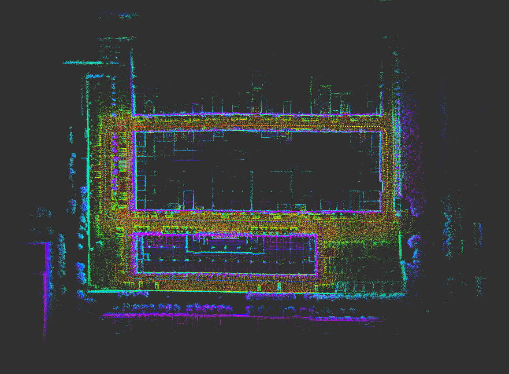
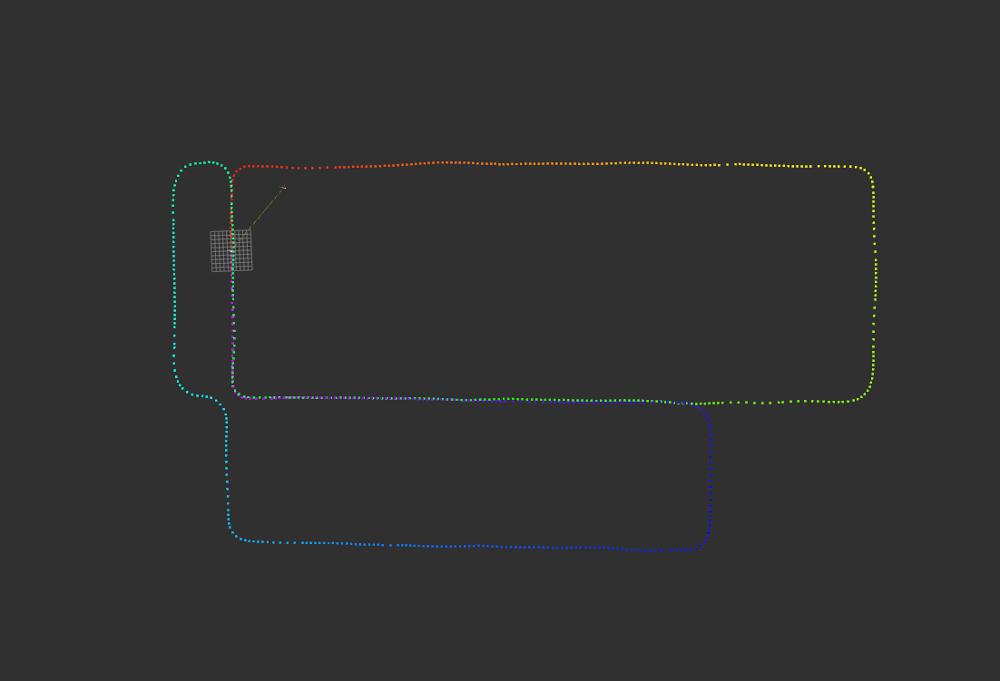
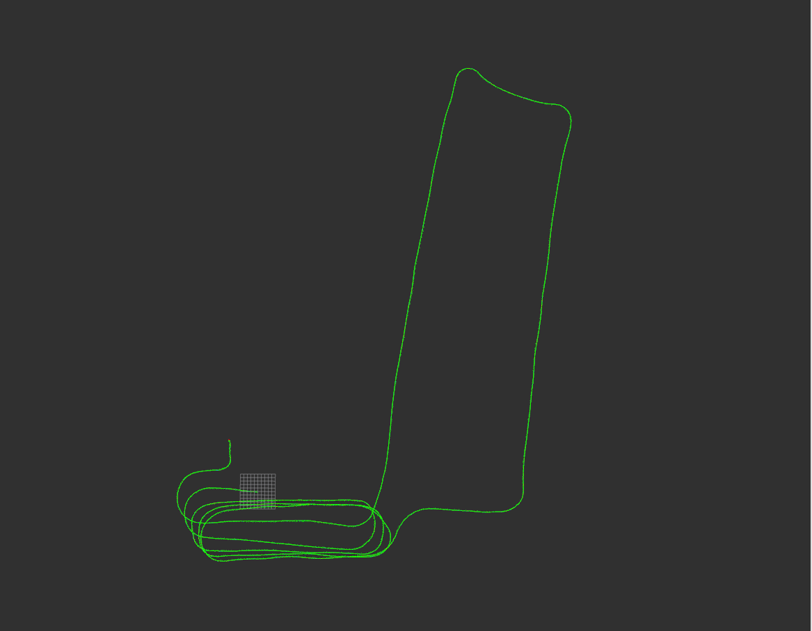
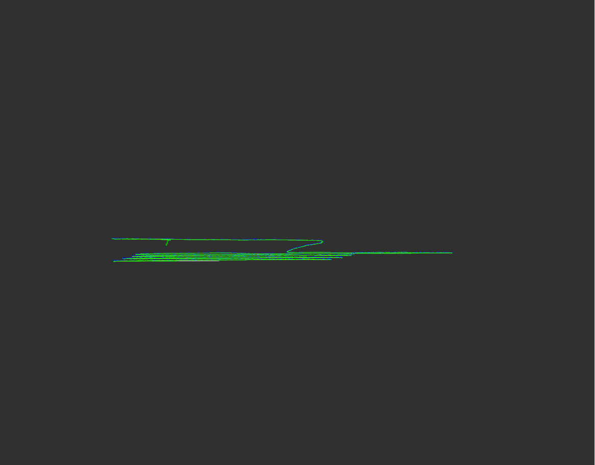
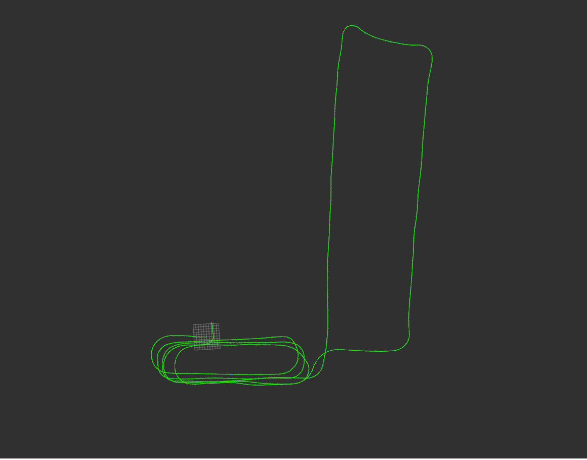
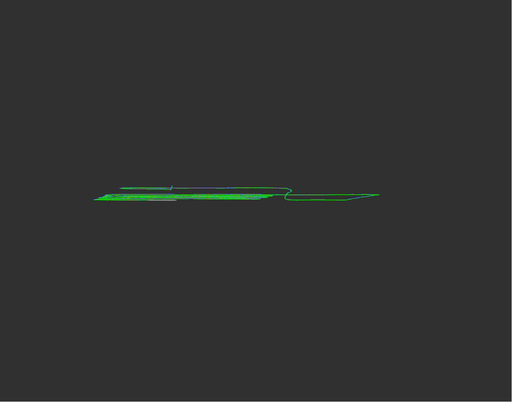

# A-LeGO-LOAM

## Introduction

~~Advanced~~ implementation of LeGO-LOAM[1].


loop-closure enabled map cloud

loop-closure enabled trajectory


## Usage

### Input

- Point Cloud(`/lslidar_point_cloud`)

### Output

- (`/laser_cloud_surround`)
- ...

### Run the package

1. Run the launch file:

```shell
roslaunch alego test2.launch
```

2. Play existing bag files [test_0515.bag](https://drive.google.com/file/d/1Y6KR9FUQggcyhvGsnkv7zpYQGvc7dQR_/view?usp=sharing):

```shell
rosbag play test_0515.bag --clock --topics /lslidar_point_cloud
```

3. Save map:
```shell
rosservice call /save_map
```

## ImageProjection

这 outlier 也太多了（将近 1/3），而且原始数据中有很多点相邻太近（将近一半），不知道是不是雷达的问题

## LaserOdometry

robo_0529.bag 粗略测试，1 step 优化时长 7915ms(1.90ms/frame)(10 iterations)



2 step 优化时长 8888ms(2.13ms/frame)，效果更好(surf 5 iterations, corner 10 iterations)



~~不知道为啥，occluded points 就是比 lego 多，也是无语了，而且真要是标记为 occluded 的话 corner feature 就太少了，匹配起来效果很差。~~ 无语了，原来是因为 cloud_msg 里的 segmentedCloudColInd 是 uint，进行算术运算再赋给 int 出了问题，然后 col_diff 就 gg 了。

## LaserMapping

注意回环后 map2odom 要及时更新

## Dependency

- [gtsam](https://github.com/borglab/gtsam/releases)(Georgia Tech Smoothing and Mapping library, 4.0.0-alpha2)
- ceres

## TODOs

- [ ] parameterize hard coded parameters.
- [ ] find out nodelet crush problem.
- [ ] adjust motion distortion.

## Referecen

1. [https://github.com/RobustFieldAutonomyLab/LeGO-LOAM](https://github.com/RobustFieldAutonomyLab/LeGO-LOAM)
2. [https://github.com/HKUST-Aerial-Robotics/A-LOAM](https://github.com/HKUST-Aerial-Robotics/A-LOAM)
3. Zhang J, Singh S. LOAM: Lidar Odometry and Mapping in Real-time[C]//Robotics: Science and Systems. 2014, 2: 9.
4. Zhang J, Singh S. Low-drift and real-time lidar odometry and mapping[J]. Autonomous Robots, 2017, 41(2): 401-416.
